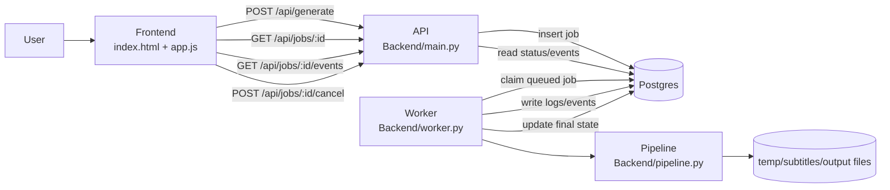
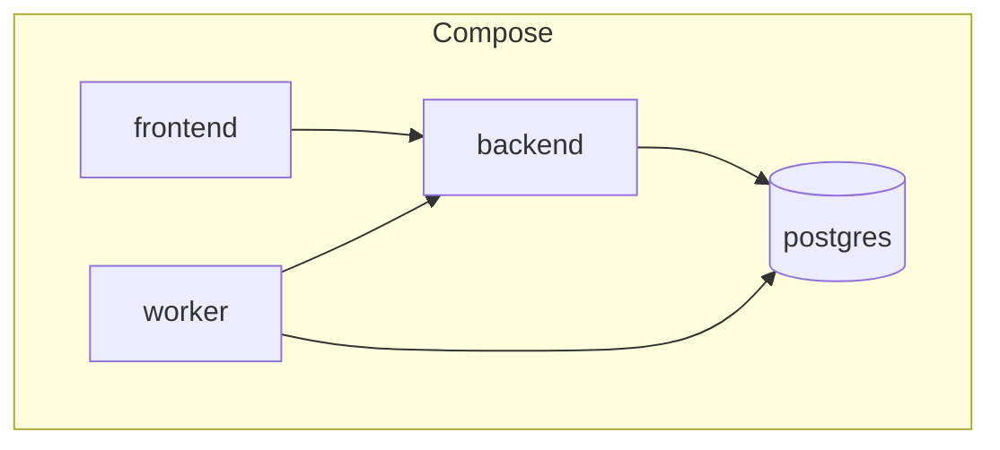
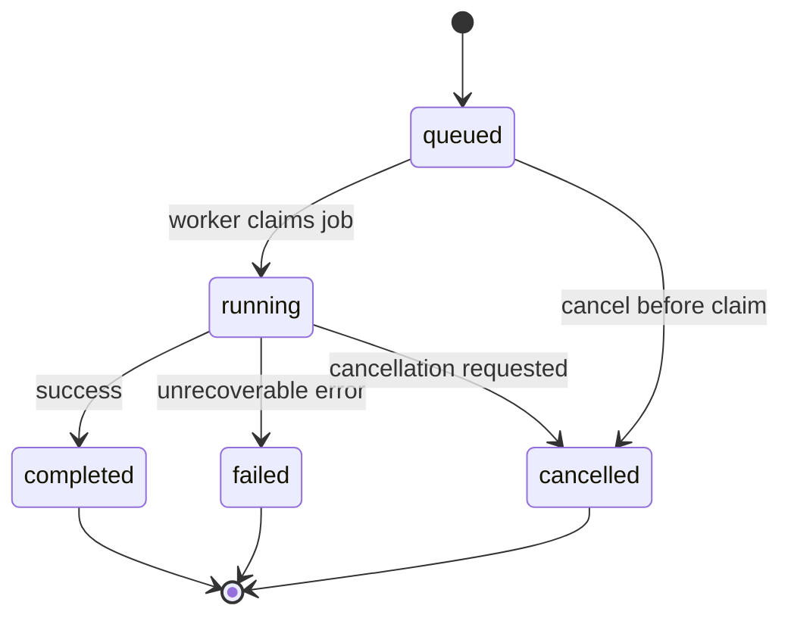
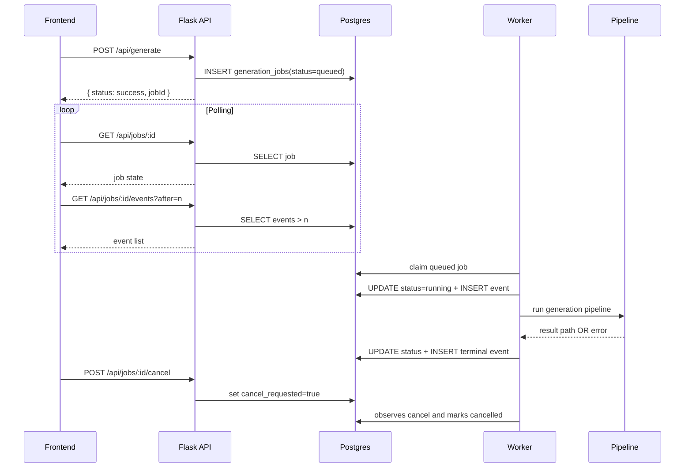
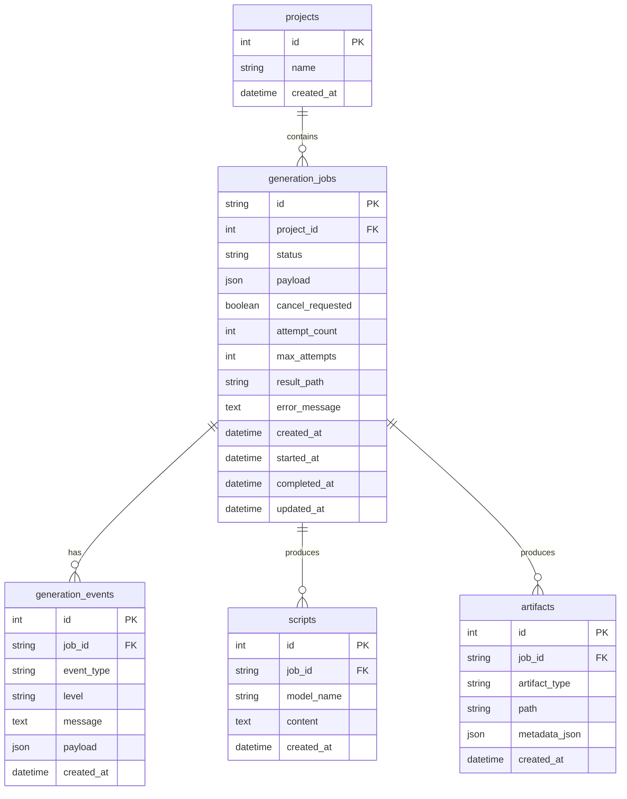

# Architecture

MoneyPrinter now uses a database-backed queue architecture designed for reliability, restart safety, and future scaling.

## Overview

- `Frontend` submits generation requests and polls job status/events.
- `API (Flask)` validates input and enqueues jobs in Postgres.
- `Worker` claims queued jobs and runs the generation pipeline.
- `Postgres` is the source of truth for job state, progress events, and artifacts.

## Runtime Services (Docker)

## Generation Lifecycle

## API + Worker Sequence

## Data Model (Current Core)

## Current Guarantees

- API is fast and non-blocking for generation requests.
- Job state and logs survive API/worker restarts.
- Cancellation is job-scoped (`cancel_requested`) and checked during processing.
- Frontend can recover progress after refresh by polling persisted events.

## Planned Next Hardening

- Add migration tool (Alembic) for schema versioning.
- Add retries/backoff with `next_retry_at` and dead-letter semantics.
- Add artifact metadata population and checksum tracking.
- Add worker concurrency controls and queue metrics endpoints.
